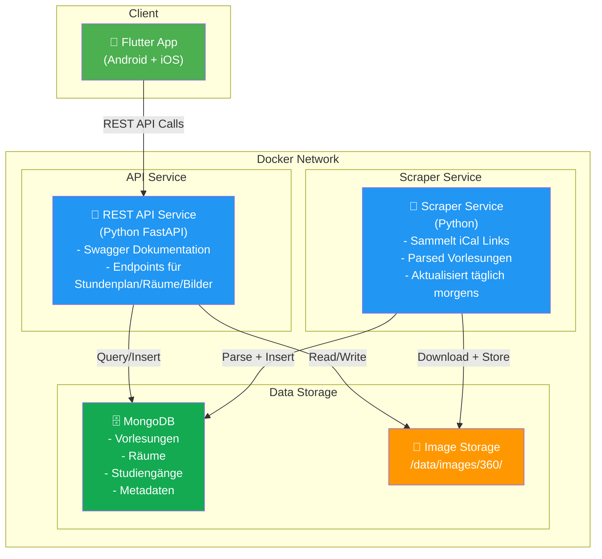

# CampusNow - System Architektur Diagramm

## System-Flow

1. **Täglich morgens (6:00 Uhr)**:
   - Scraper-Service startet
   - Feldt HS-Aalen Starplan Website nach iCal-Links
   - Ladet und parsed iCal-Dateien
   - Downloaded neue 360°-Bilder der Räume
   - Speichert alles in MongoDB + Dateisystem

2. **Flutter App**:
   - Ruft REST-API bei Bedarf ab
   - Zeigt Stundenplan nach Raum/Studiengang
   - lädt 360°-Bilder für Street-View

3. **REST-API**:
   - Liefert Echtzeit-Daten aus MongoDB
   - Serviert Bilder mit verschiedenen Größen
   - Automatisch dokumentiert mit Swagger
