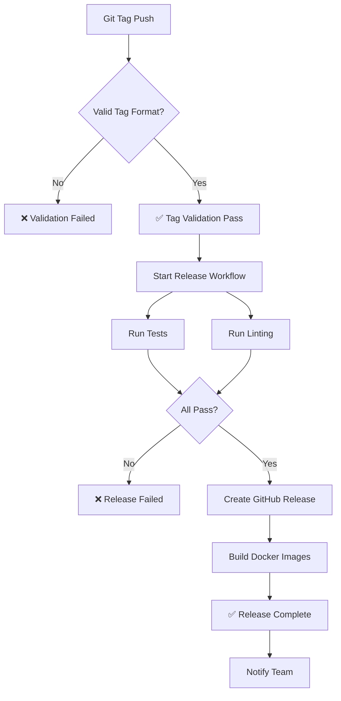

# Tag & Release Workflow Guide

## 🏷️ Tag Format

CampusNow nutzt **Semantic Versioning** für Releases:

```
v1.0.0          ← Normale Release
v1.0.0-rc1      ← Release Candidate
v1.0.0-alpha1   ← Alpha Release
v1.0.0-beta1    ← Beta Release
```

---

## 🚀 Release erstellen

### Schritt 1: CHANGELOG.md vorbereiten

Bearbeite `CHANGELOG.md` und füge Änderungen unter "Unreleased" ein:

```markdown
## [Unreleased]

### Added
- Feature 1
- Feature 2

### Fixed
- Bug fix 1

## [1.0.0] - 2026-03-20
...
```

### Schritt 2: All-Commits pushen

```bash
# Alle Änderungen committen & pushen
git add .
git commit -m "chore: prepare v1.1.0 release"
git push origin develop
```

### Schritt 3: Merge zu main (optional)

Wenn du in `develop` arbeitest:

```bash
# zu main wechseln
git checkout main
git pull origin main

# develop mergen
git merge develop

# pushen
git push origin main
```

### Schritt 4: Tag erstellen

```bash
# Tag lokal erstellen
git tag -a v1.1.0 -m "Release version 1.1.0

Added:
- New feature X
- Improved performance

Fixed:
- Bug Y

See CHANGELOG.md for full details"

# Tag zu GitHub pushen
git push origin v1.1.0
```

### 🎉 Automatische Workflows starten!

Nach `git push origin v1.1.0`:

1. ✅ **Tag Validation** Workflow
   - Prüft Tag-Format (muss `vX.Y.Z` entsprechen)
   
2. ✅ **Release & Deployment** Workflow
   - Führt finale Tests aus
   - Prüft Linting
   - Erstellt GitHub Release
   - Baut Docker Images
   - Generiert Release Notes

**Kein manuelles Deployment nötig!** 🤖

---

## 🔍 Workflow Details

### Tag Validation Workflow

Läuft automatisch bei jedem neue Tag:

```
✅ Validiert Semantic Versioning Format
✅ Gibt Fehler aus bei ungültigem Format
✅ Blockiert Release wenn Tag invalid ist
```

### Release & Deployment Workflow

Läuft nur bei gültigen Version-Tags:

```
1️⃣  Checkout Code
2️⃣  Python Setup (3.11)
3️⃣  Install Dependencies
4️⃣  Run Final Tests
    - pytest für Scraper
    - pytest für API
5️⃣  Run Lint Checks
    - Ruff Check
    - Flake8 Check
6️⃣  Verify CHANGELOG.md
7️⃣  Create GitHub Release (mit Auto-GeneratedRelease Notes)
8️⃣  Build Docker Images
    - campusnow:scraper-v1.1.0
    - campusnow:api-v1.1.0
    - campusnow:scraper-latest
    - campusnow:api-latest
```

---

## 📝 Complete Release Checklist

- [ ] Alle Features in `develop` merged
- [ ] CHANGELOG.md aktualisiert
- [ ] `git commit` mit aussagekräftiger Message
- [ ] `git push origin develop` (oder main)
- [ ] Testing lokal (optional): `make ci-local`
- [ ] Tag mit Semantic Versioning: `git tag -a v?.?.? -m "..."
- [ ] Tag pushen: `git push origin v?.?.?`
- [ ] GitHub Actions Log prüfen (Actions → Release)
- [ ] GitHub Releases Seite prüfen
- [ ] Docker Images im Release verfügbar

---

## 🎯 CI Pipeline Effizienzen

### ✅ CI Pipeline läuft nur wenn:
- Code-Änderungen gepusht werden (keine Docs!)
- Pull Requests zu main/develop
- Manuell via `workflow_dispatch`

### ❌ CI Pipeline ignoriert:
- Reine Markdown-Änderungen (`*.md`)
- `.editorconfig`, `.gitignore`, `LICENSE`
- `docs/` Verzeichnis

### ✅ Code Quality läuft nur wenn:
- CI Pipeline erfolgreich war
- Auf main oder develop branches
- Manuell via `workflow_dispatch`

### ✅ Dependencies läuft nur wenn:
- Wöchentlich geratet (Montag 2 AM UTC)
- Nach Release erfolgreich
- Manuell via `workflow_dispatch`

### ✅ Release läuft nur wenn:
- Gültiger Version-Tag gepusht wird
- Manuell via `workflow_dispatch`

---

## 🔥 Pro Tips

### Tag schnell löschen (falls falsch)?

```bash
# Lokal löschen
git tag -d v1.0.0

# Remote löschen
git push origin --delete v1.0.0
```

### Release Notes auto-generieren lassen

GitHub generiert Release Notes automatisch basierend auf:
- Merged Pull Requests
- Commit Messages
- Labels der PRs

**Best Practice:** Nutze semantische Commit Titles in PRs!

### RC (Release Candidate) vor finale Release

```bash
# Erst RC für Testing
git tag -a v1.1.0-rc1 -m "Release Candidate for v1.1.0"
git push origin v1.1.0-rc1

# GitHub markiert als "Pre-release"
# Nach Test: finale Release
git tag -a v1.1.0 -m "Release v1.1.0"
git push origin v1.1.0
```

### Nur bestimmter Branch releasen

Standard: `main` oder `develop`

Um sicherzustellen: Regel im Tag-Namen verwenden:
```
v1.1.0          ← main source
v1.1.0-dev      ← from develop (optional)
```

---

## 📊 Workflow Übersicht



---

## 🆘 Troubleshooting

### Release fehlgeschlagen?

1. **Check GitHub Actions Log:**
   - https://github.com/YOUR_USERNAME/CampusNow/actions
   - Klick auf fehlgeschlagenes Workflow
   - Schau `Create Release` Step Details

2. **Häufige Probleme:**
   - ❌ Tag-Format ungültig → Nutze `vX.Y.Z`
   - ❌ CHANGELOG.md fehlt → Erstelle/update sie
   - ❌ Tests fehlgeschlagen → Debug lokal `make test`
   - ❌ Linting-Fehler → Fix lokal `make format && make lint`

3. **Manuell testen:**
   ```bash
   make ci-local  # Simuliere vollständige Pipeline
   ```

---

## 📚 Weitere Ressourcen

- [Semantic Versioning](https://semver.org/)
- [GitHub Actions Docs](https://docs.github.com/en/actions)
- [Keep a Changelog](https://keepachangelog.com/)
- [Conventional Commits](https://www.conventionalcommits.org/)

---

**Happy Releasing! 🚀**
