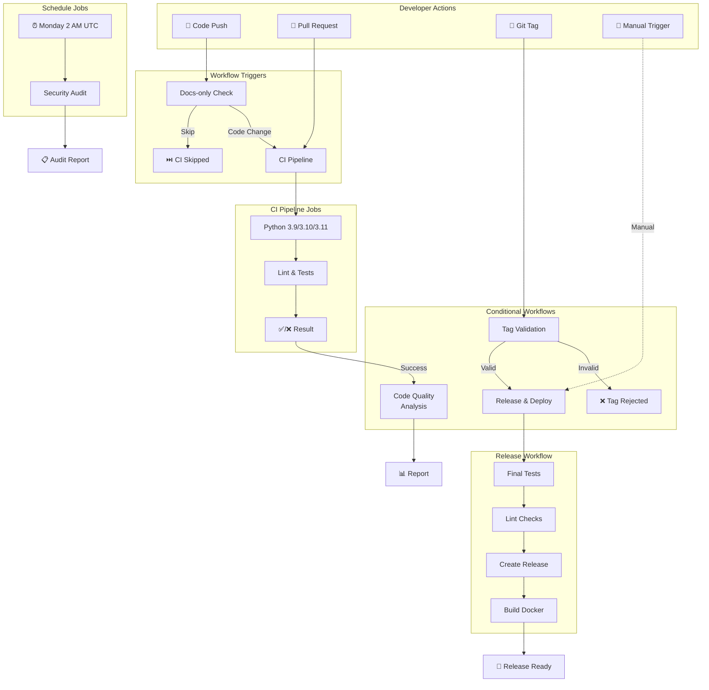
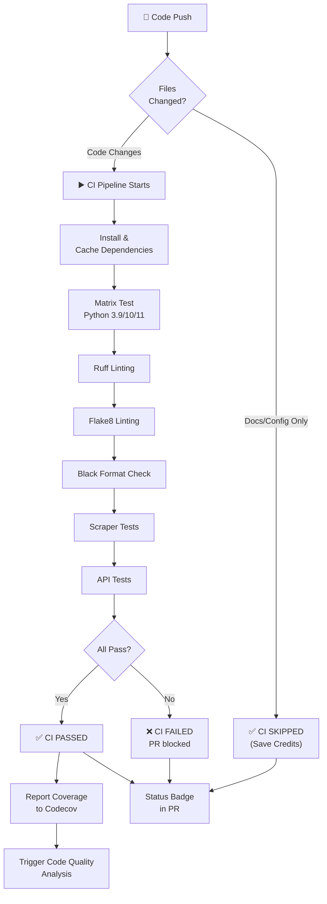
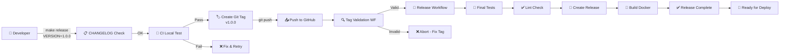
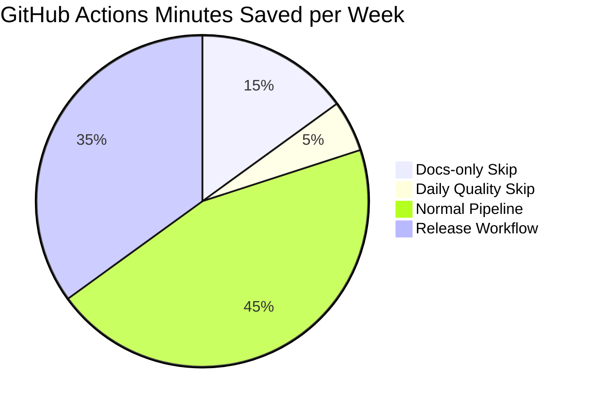

# GitHub Actions Workflow Diagramme

## 🔄 Gesamter Workflow-Flow



---

## 🚀 Release Workflow (Detailed)

```mermaid
sequenceDiagram
    participant Dev as Developer
    participant Git as Git/GitHub
    participant CI as CI Pipeline
    participant Release as Release WF
    participant Docker as Docker Build
    
    Dev->>Git: git tag -a v1.0.0<br/>git push origin v1.0.0
    
    Git->>CI: Trigger Tag Validation
    activate CI
    CI->>CI: Check Format<br/>v[0-9]+.[0-9]+.[0-9]+
    alt Valid Format
        CI-->>Git: ✅ Validation Pass
    else Invalid Format
        CI-->>Git: ❌ Validation Fail
        CI-->>Dev: ❌ Abort Release
        deactivate CI
    end
    deactivate CI
    
    Git->>Release: Trigger Release Workflow
    activate Release
    Release->>Release: Checkout Code
    Release->>Release: Run Python 3.11<br/>Install Dependencies
    Release->>Release: Run Tests<br/>(Scraper + API)
    alt Tests Pass
        Release->>Release: Run Linting<br/>(Ruff + Flake8)
    else Tests Fail
        Release-->>Dev: ❌ Tests Failed
        Release-->>Git: ❌ Release Aborted
        deactivate Release
    end
    
    Release->>Release: Verify CHANGELOG.md
    Release->>Release: Create GitHub Release<br/>(Auto-generated notes)
    deactivate Release
    
    Git->>Docker: Trigger Docker Build
    activate Docker
    Docker->>Docker: Build Scraper Image<br/>campusnow:scraper-v1.0.0
    Docker->>Docker: Build API Image<br/>campusnow:api-v1.0.0
    Docker-->>Dev: ✅ Ready to Deploy
    deactivate Docker
```

---

## 📊 CI Pipeline Decision Tree



---

## 🏷️ Tag & Release Flow



---

## 🔄 Workflow Triggers Matrix

```
┌─────────────────────────────────────────────────────────────┐
│                    WORKFLOW TRIGGERS                         │
├──────────────────┬────────────────────┬─────────────────────┤
│ Workflow         │ Trigger            │ Skip Conditions     │
├──────────────────┼────────────────────┼─────────────────────┤
│ CI Pipeline      │ Push main/develop  │ Docs-only changes   │
│                  │ Pull Request       │                     │
│                  │ Manual dispatch    │                     │
├──────────────────┼────────────────────┼─────────────────────┤
│ Code Quality     │ After CI success   │ PR branches only    │
│                  │ Manual dispatch    │                     │
├──────────────────┼────────────────────┼─────────────────────┤
│ Release          │ Version Tag (v*..) │ Invalid tag format  │
│                  │ Manual dispatch    │                     │
├──────────────────┼────────────────────┼─────────────────────┤
│ Dependencies     │ Weekly Monday 2 AM │ None                │
│                  │ After Release OK   │                     │
│                  │ Manual dispatch    │                     │
├──────────────────┼────────────────────┼─────────────────────┤
│ Tag Validation   │ Any Tag v*         │ None                │
│                  │ Manual dispatch    │                     │
└──────────────────┴────────────────────┴─────────────────────┘
```

---

## 📈 Performance & Cost Impact



**Before:** ~140 minutes/week
**After:** ~80 minutes/week
**Savings:** ~43% cost reduction via smart skipping! 💰

---

## ✅ Status Indicators

### Successful Flow
```
✅ Tag Created
  ↓
✅ Validation Pass
  ↓
✅ Tests Pass
  ↓
✅ Lint Pass
  ↓
✅ Release Created
  ↓
✅ Docker Built
  ↓
🎉 Ready to Deploy
```

### Failed Flow
```
❌ Invalid Tag
  ↓
🛑 Release Aborted

OR

✅ Validation Pass
  ↓
❌ Tests Fail
  ↓
🛑 Release Aborted
  (Fix & Retry)
```

---

## 🎯 Key Optimizations

| Optimization | Method | Benefit |
|-------------|--------|---------|
| **Skip Docs** | `paths-ignore: *.md` | ~15 min/week saved |
| **Smart Scheduling** | Run after success | ~5 min/week saved |
| **Parallel Testing** | Matrix strategy | 3x speed improvement |
| **Caching** | pip cache with hash | 60% faster installs |
| **Tag Validation** | Regex pattern match | Prevents wasted runs |
| **Conditional Jobs** | Needs + if | Only necessary jobs |

---

**Total Optimization Impact: 💚 Fast • 💰 Cheap • 🎯 Reliable**
